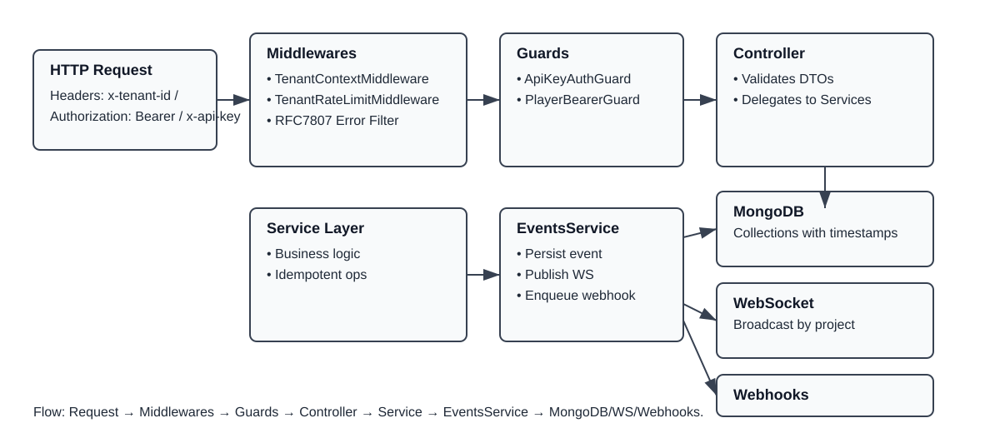

# System Architecture

High-level overview of the gamification platform built with **NestJS** and **MongoDB (Mongoose)**. The system provides REST ingestion/query, persists events, and distributes them via **WebSocket** and **Webhooks**.

## Request Flow (REST)
- Client sends a request with `x-tenant-id` (except health and Swagger).
- Global middlewares:
  - `TenantRateLimitMiddleware` applies per-tenant REST rate limits.
  - `TenantContextMiddleware` validates and injects `req.tenantId` (skips `/v1/health` and Swagger; whitelists `/v1/player/*` when Bearer is present).
- Controllers handle requests and delegate to Services.
- Services validate `tenantId` and `projectId` (when applicable), execute operations, persist data, and emit events through `EventsService.log(...)`.
- `EventsService` persists to Mongo, publishes to **Realtime** and enqueues **Webhooks** deliveries.

## Core Modules
- `projects`: tenant projects lifecycle.
- `players`: player lifecycle (profile, wallet, level, credentials).
- `progression`: XP/level progression and customizable curves.
- `achievements`: threshold-based unlocks and listing.
- `items`: catalog, grant, and consume operations.
- `inventory`: wallet operations and idempotent transactions.
- `store`: SKUs/catalog and idempotent purchases.
- `quests`: goals and rewards (XP/items).
- `counters`: per-player/project counters.
- `events`: persistence and fan-out (WS/Webhooks).
- `webhooks`: subscriptions, deliveries, retries, HMAC signatures.
- `realtime`: WS gateway + publication service.
- `admin`: administrative routes (plans, metrics, project plan).
- `client`: dashboard routes (API keys, project metrics, player queries).
- `player-auth`: player authentication (username/email + password), Bearer-protected player endpoints.

## Persistence
- MongoDB with Mongoose; schemas use `timestamps` for auditing.
- Indexes on critical fields (`tenantId`, `projectId`, `active`, unique sparse indexes on `email`).
- Idempotency via `idempotencyKey` for critical operations (wallet, items, quests, store).

## Event Pipeline
- `EventsService.log({ tenantId, projectId, type, playerId?, payload? })`:
  - Persist event (Mongo `events` collection).
  - Publish to the WebSocket channel for the `projectId`.
  - Enqueue delivery for Webhook subscribers.
- Example event types: `player.created`, `player.xp.added`, `player.levelup`, `quest.completed`, `achievement.unlocked`, `store.purchase.succeeded`.

## Realtime (WebSocket)
- Gateway validates `x-api-key`, `x-project-id`, `x-tenant-id` (headers or query string).
- Connection limits via `REALTIME_MAX_CLIENTS` (default 1000).
- Subscriptions limited by `REALTIME_MAX_EVENTTYPES` (default 50).
- Publication routed by `projectId` and `eventTypes`; wildcard `*` is supported.

## Webhooks
- Subscriptions per `projectId` with asynchronous delivery and retries.
- `WebhookDelivery` records status, attempts, and payload.
- Policies supported via `webhookTimeoutMs` and `webhooksMaxPerMin`.

## Authentication & Security
- Multi-tenant via `x-tenant-id`.
- **API Keys** for clients/integrations:
  - REST: `ApiKeyAuthGuard` protects client endpoints.
  - WS: validation of `x-api-key` + `x-project-id`.
  - Per-key rate limit (`rateLimitPerMin`).
  - Secure storage: SHA-256 `hash` + `prefix` for display.
- **Admin API Keys**:
  - REST: admin routes (`/v1/admin/*`) and Webhooks (`/v1/webhooks/*`) require `x-api-key` with a tenant-level key (no `projectId`).
  - Guard: `AdminApiKeyAuthGuard` validates active keys belonging to the tenant with roles including `owner` or `admin`, and applies per-key rate limit.
- **Player Bearer Tokens**:
  - Password-based register/login (`username` or `email` + `password` + `projectId`).
  - Bearer-protected player routes; token payload sets `tenantId` and `projectId`.
  - Per-player rate limit (configurable via `PLAYER_RPS_DEFAULT`).
- Swagger documents `x-tenant-id`, `x-api-key`, and Bearer; use "Authorize" to provide credentials.

## Plans & Limits
- Per-tenant REST rate limit and per API Key guard rate limits.
- Plans define `limits` and `features`; future integration will adjust middlewares and quotas per project.

## Implementation Standards
- Early validation (`BadRequestException`, `NotFoundException`, `UnauthorizedException`).
- Idempotency on state-changing operations (wallet, purchases, items, quests).
- Events emitted for every relevant state change.
- DTOs with `class-validator` and Swagger `@ApiProperty`/`@ApiBody` examples.

## Observability
- Admin Metrics: global views (projects, players, events/month, webhooks).
- Structured logs (JSON) recommended; correlation IDs (planned).

## Living Documentation
- Swagger at `http://localhost:3000/v1/docs` (or `3001` if you started another server).
- References:
  - `docs/PLANS.md` — plans and project linkage.
  - `docs/API_KEYS.md` — issuing and using API Keys.
  - `docs/LIMITS.md` — rate limits and quotas.
  - `docs/REST.md` — REST quick examples and flows.
  - `docs/WS.md` — WebSocket usage.
  - `docs/WEBHOOKS.md` — subscriptions and deliveries.
  - `docs/API_HEADERS.md` — standard headers.
  - `docs/PLAYER_AUTH.md` — player register/login and profile flows.

## Roadmap
- Quotas middleware per plan (block/alert on excess).
- Full RBAC in admin/client dashboards with `roles` and `scopes`.
- Detailed per-project metrics and additional reporting endpoints.